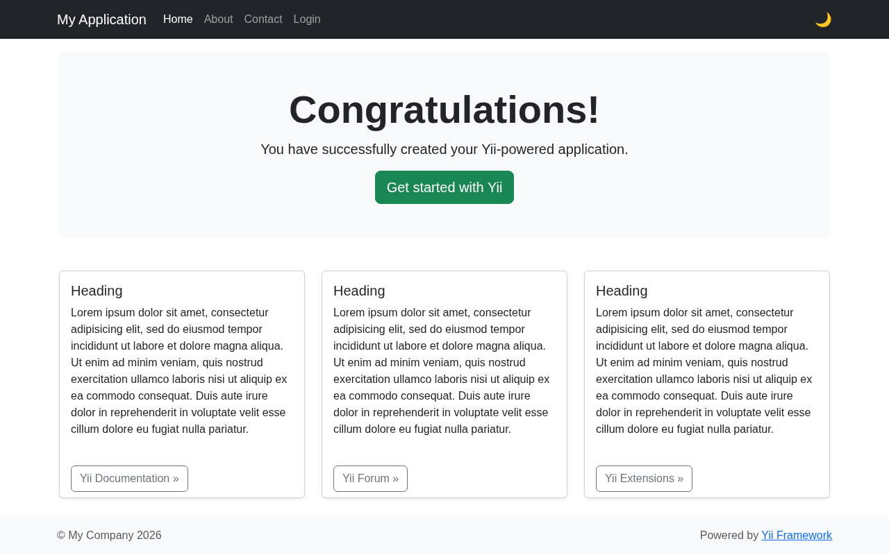
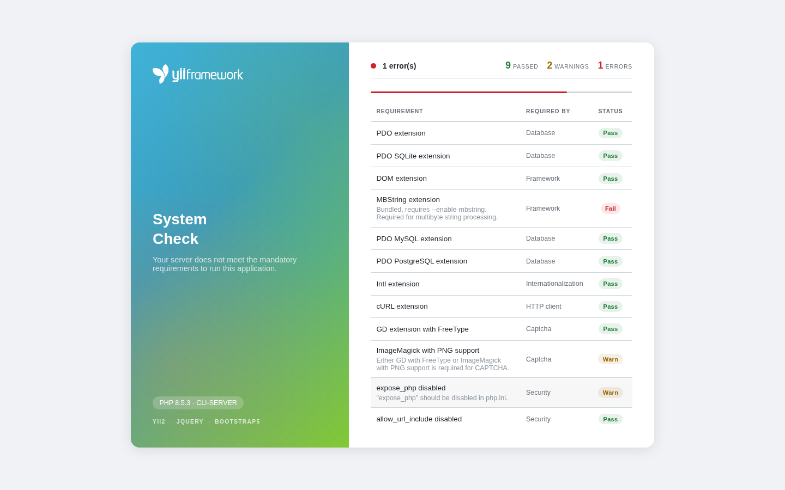
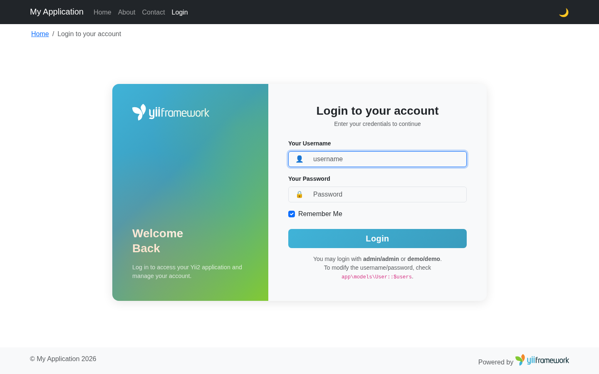
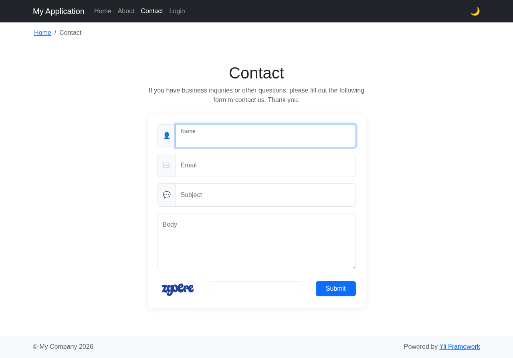
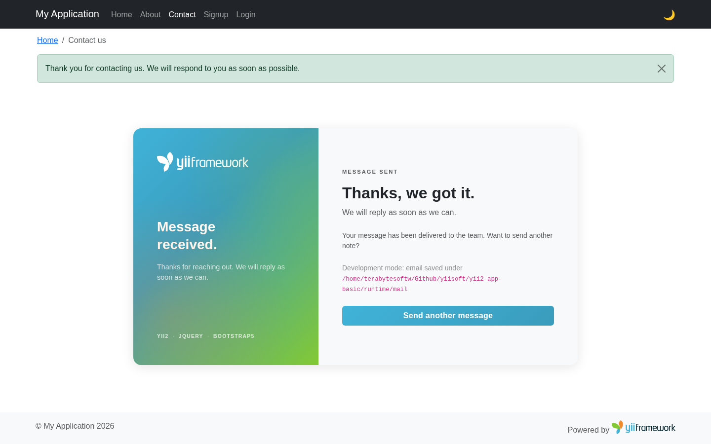
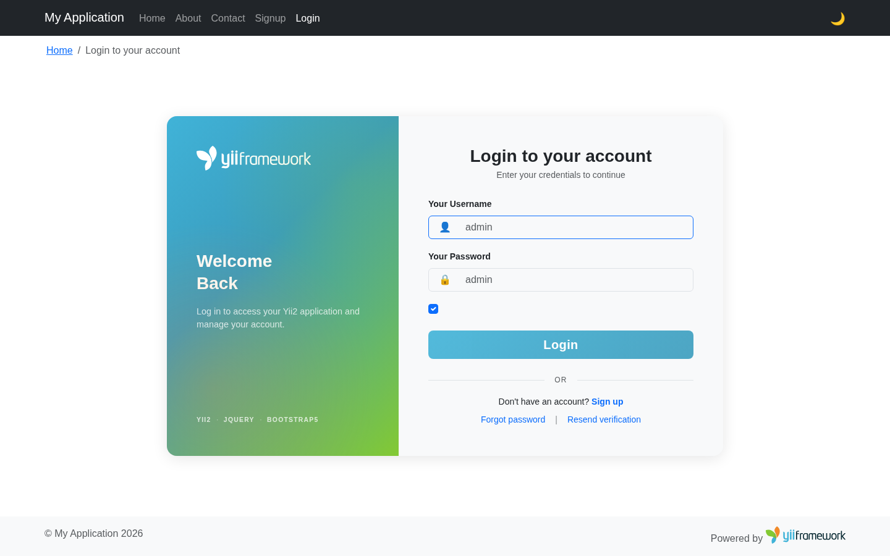

<p align="center">
    <picture>
        <source media="(prefers-color-scheme: dark)" srcset="https://www.yiiframework.com/image/design/logo/yii3_full_for_dark.svg">
        <source media="(prefers-color-scheme: light)" srcset="https://www.yiiframework.com/image/design/logo/yii3_full_for_light.svg">
        
    </picture>
    <h1 align="center">Yii2 Basic Project Template</h1>
    <br>
</p>

Yii 2 Basic Project Template is a skeleton [Yii2](https://www.yiiframework.com/) application best for rapidly creating 
small projects.

The template contains the basic features including user registration, login/logout, contact page, user management with 
GridView, RBAC authorization, database migrations (SQLite), and Bootstrap5 dark/light theme support.

[](https://packagist.org/packages/yiisoft/yii2-app-basic)
[](https://packagist.org/packages/yiisoft/yii2-app-basic)
[](https://github.com/yiisoft/yii2-app-basic/actions?query=workflow%3Abuild+branch%3A22)
[](https://codecov.io/gh/yiisoft/yii2-app-basic/branch/22)
[](https://github.com/yiisoft/yii2-app-basic/actions?query=workflow%3Astatic+branch%3A22)

<picture>
    <source media="(prefers-color-scheme: dark)" srcset="docs/images/home-dark.png">
    <source media="(prefers-color-scheme: light)" srcset="docs/images/home-light.png">
    
</picture>

## Requirements

> [!IMPORTANT]
> The minimum required PHP version is **8.3**.

The requirements checker runs automatically in development mode when the application starts.
If any mandatory extension is missing (PDO, PDO SQLite, DOM, MBString), a standalone error page is displayed before the 
framework loads.

<picture>
    <source media="(prefers-color-scheme: dark)" srcset="docs/images/requirements-standalone-dark.png">
    <source media="(prefers-color-scheme: light)" srcset="docs/images/requirements-standalone-light.png">
    
</picture>

## Docker

[](https://github.com/yiisoft/yii2-app-basic/actions?query=workflow%3Adocker+branch%3A22)

## Directory structure

```text
config/             application configurations
public/             web entry point and static assets
  css/              application stylesheets
  images/           logo and SVG images
  js/               JavaScript (dark mode toggle)
rbac/               RBAC assignments, items, and rules
resources/
  mail/             email templates (verification, password reset)
  views/            view files (layouts, site, user)
runtime/            files generated during runtime
src/
  assets/           asset bundle definitions
  commands/         console commands
  controllers/      web controllers (Site, User)
  migrations/       database migrations
  models/           model classes (User, ContactForm, SignupForm, etc.)
  widgets/          custom widgets (Alert)
tests/              Codeception test suites (unit, functional, acceptance)
```

## Installation

This package requires [npm](https://www.npmjs.com/) for [php-forge/foxy](https://github.com/php-forge/foxy), which 
manages the installation of npm packages and resource compilation.

### Install via Composer

If you do not have [Composer](https://getcomposer.org/), you may install it by following the instructions
at [getcomposer.org](https://getcomposer.org/doc/00-intro.md#installation-nix).

You can then install this project template using the following command:

```
composer create-project --prefer-dist --stability=dev yiisoft/yii2-app-basic:^22.0 basic
```

### Run database migrations

The application uses SQLite by default. Run the migrations to create the database and seed the admin user:

```
cd basic
./yii migrate
```

### Start the development server

```
./yii serve --docroot=public
```

You can then access the application at:

```
http://localhost:8080
```

Default admin credentials: `admin` / `admin`

### Install with Docker

Start the container:

```
docker-compose up -d
```

Run migrations inside the container:

```
docker-compose exec php ./yii migrate
```

You can then access the application at:

```
http://127.0.0.1:8000
```

## Configuration

### Database

The default configuration uses SQLite at `runtime/db.sqlite`. Edit `config/db.php` to change:

```php
return [
    'class' => \yii\db\Connection::class,
    'dsn' => 'sqlite:' . dirname(__DIR__) . '/runtime/db.sqlite',
];
```

To use MySQL or PostgreSQL, update the DSN and ensure the corresponding PDO extension is installed.

### Cookie validation key

Set a secret key in `config/web.php` (auto-generated by Composer on install):

```php
'request' => [
    'cookieValidationKey' => '<secret random string goes here>',
],
```

## Screenshots

<details>
<summary>Login</summary>
<picture>
    <source media="(prefers-color-scheme: dark)" srcset="docs/images/login-dark.png">
    <source media="(prefers-color-scheme: light)" srcset="docs/images/login-light.png">
    
</picture>
</details>

<details>
<summary>Contact</summary>
<picture>
    <source media="(prefers-color-scheme: dark)" srcset="docs/images/contact-dark.png">
    <source media="(prefers-color-scheme: light)" srcset="docs/images/contact-light.png">
    
</picture>
</details>

<details>
<summary>Contact submitted</summary>
<picture>
    <source media="(prefers-color-scheme: dark)" srcset="docs/images/contact-submitted-dark.png">
    <source media="(prefers-color-scheme: light)" srcset="docs/images/contact-submitted-light.png">
    
</picture>
</details>

<details>
<summary>User directory (admin)</summary>
<picture>
    <source media="(prefers-color-scheme: dark)" srcset="docs/images/users-dark.png">
    <source media="(prefers-color-scheme: light)" srcset="docs/images/users-light.png">
    
</picture>
</details>

## Testing

Tests are located in `tests/` and developed with [Codeception](https://codeception.com/).
There are 3 test suites:

- `unit` - system components and model logic
- `functional` - user interaction (forms, authentication, password reset)
- `acceptance` - browser-based tests

Run all tests with the built-in web server:

```
vendor/bin/codecept run --env php-builtin
```

Or use the Composer script:

```
composer tests
```

### Code coverage

```
vendor/bin/codecept run --env php-builtin --coverage --coverage-html --coverage-xml
```

Coverage output is generated under `tests/support/output/`.

## Code quality

```
# Static analysis (PHPStan level max)
composer static

# Code style (ECS)
composer ecs
```

## Support the project

[](https://opencollective.com/yiisoft)

## Follow updates

[](https://www.yiiframework.com/)
[](https://x.com/yiiframework)
[](https://t.me/yii_framework_in_english)
[](https://yiiframework.com/go/slack)

## License

[](LICENSE)
